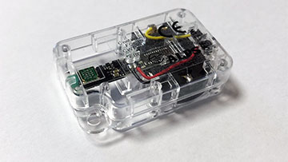

node-alps
===============

[[Japanese (日本語)](README_ja.md)]

The node-alps is a Node.js module which allows you to communicate with the [ALPS Sensor Network Module Evaluation Kit](https://www.alps.com/e/iotsmart-network/) via BLE.

[](imgs/alps_l.jpg)

The [ALPS Sensor Network Module Evaluation Kit](https://www.alps.com/e/iotsmart-network/) is a multi-function sensor module for acquisition and transmission of motion and environmental data. The device contains an accelerometer sensor, a geo-magnetic sensor, a pressure sensor, a humidity sensor, a temperature sensor, a UV sensor, an ambient light sensor. The node-alps exposes APIs which sets configurations, listens to notifications, scans advertising packets, and so on.

Note that this module is *not* an ALPS official SDK.

## Dependencies

* [Node.js](https://nodejs.org/en/) 6 +
* [noble](https://www.npmjs.com/package/noble)

## Installation

```
$ cd ~
$ npm install noble
$ npm install node-alps
```

---------------------------------------
## Table of Contents

* [Quick Start](#Quick-Start)
  * [Discovering and connecting to a device](#Quick-Start-1)
  * [Monitoring the environment sensors](#Quick-Start-2)
  * [Monitoring the motion sensors](#Quick-Start-3)
  * [Setting and monitoring the beacons](#Quick-Start-4)
* [`Alps` object](#Alps-object)
  * [`init()` method](#Alps-init-method)
  * [`discover()` method](#Alps-discover-method)
  * [`scartScan()` method](#Alps-startScan-method)
  * [`stopScan()` method](#Alps-stopScan-method)
  * [`onadvertisement` event handler](#Alps-onadvertisement-event-handler)
* [`AlpsDevice` object](#AlpsDevice-object)
  * [Properties](#AlpsDevice-properties)
  * [`ondisconnect` event handler](#AlpsDevice-ondisconnect-event-handler)
  * [`onnotify` event handler](#AlpsDevice-onnotify-event-handler)
  * [`connect()` method](#AlpsDevice-connect-method)
  * [`disconnect()` method](#AlpsDevice-disconnect-method)
  * [`isConnected()` method](#AlpsDevice-isConnected-method)
  * [`setBeaconMode()` method](#AlpsDevice-setBeaconMode-method)
  * [`startMonitor()` method](#AlpsDevice-startMonitor-method)
  * [`stopMonitor()` method](#AlpsDevice-stopMonitor-method)
  * [`getStatus()` method](#AlpsDevice-getStatus-method)
  * [`getDeviceName()` method](#AlpsDevice-getDeviceName-method)
  * [`setDeviceName()` method](#AlpsDevice-setDeviceName-method)
* [`AlpsAdvertisement` object](#AlpsAdvertisement-object)
  * [Normal Advertising mode](#AlpsAdvertisement-object-Normal)
  * [Sensor Beacon mode](#AlpsAdvertisement-object-Sensor)
  * [General Beacon mode](#AlpsAdvertisement-object-General)
* [Release Note](#Release-note)
* [References](#References)
* [License](#License)

---------------------------------------
## <a id="Quick-Start">Quick Start</a>

### <a id="Quick-Start-1">Discovering and connecting to a device</a>

The sample code below shows how to discover, connect to, and disconnect a device:

```JavaScript
// Alps constructor
const Alps = require('node-alps');
// Create an Alps object
const alps = new Alps();
// AlpsDevice object
let device = null;

// Initialize an Alps object
alps.init().then(() => {
  // Start to discover devices
  return alps.discover({
    duration: 5000, // Wait for up to 5 seconds
    quick: true     // Stop the discovering process when a device is found
  });
}).then((device_list) => {
  // Check if a device was found
  if(device_list.length === 0) {
    throw new Error('No device was found.');
  }
  // AlpsDevice object representing the found device
  device = device_list[0];
  console.log('A device was found: ' + device.advertisement.localName);
  // Connect to the device
  console.log('Connecting...');
  return device.connect();
}).then(() => {
  console.log('Connected.');
  /*--------------------------------------
  * Do something with the device.
  * ----------------------------------- */
  // Disconnect the device
  console.log('Disconnecting...');
  return device.disconnect();
}).then(() => {
  console.log('Disconnected.');
  process.exit();
}).catch((error) => {
  console.error(error);
  process.exit();
});
```

In order to use this module, the [`Alps`](#Alps-object) object has to be created by the `Alps` constructor at first. In the code above, the variable `alps` corresponds to the [`Alps`](#Alps-object) object.

The [`Alps`](#Alps-object) object is activated by calling the [`init()`](#Alps-init-method) method. All methods implemented in the [`Alps`](#Alps-object) object are asynchronous and return the `Promise` object.

The [`discover()`](#Alps-discover-method) method implemented in the [`Alps`](#Alps-object) object discovers nearby devices. The method takes two arguments. In the code above, the `duration` property is set to `5000` (5 seconds), which is the wait time for discovering nearby devices. If the `quick` property is set to `true`, this method finishes the discovery process when a device is found even if the wait time (the `duration` property) remains.

The [`discover()`](#Alps-discover-method) method calls the `resolve()` function with an `Array` object containing [`AlpsDevice`](#AlpsDevice-object) objects representing the found devices. In the code above, [`AlpsDevice`](#AlpsDevice-object) representing a device found first is assigned to the variable `device`.

At this point of time, the device is not ready to be controlled yet. To do so, you have to establish a connection with the device using the [`connect()`](#AlpsDevice-connect-method) method. After the device connected successfully, all methods implemented in the [`AlpsDevice`](#AlpsDevice-object) object will be ready to use.

At last, in order to disconnect the device, use the [`disconnect()`](#AlpsDevice-disconnect-method) method.

Executing the sample code above, you can see the result as follows:

```
A device was found: SNM00
Connecting...
Connected.
Disconnecting...
Disconnected.
```

### <a id="Quick-Start-2">Monitoring the environment sensors</a>

Many types of sensors are equipped in the device. The device supports two modes for monitoring the measuring results: the environment sensors mode and the motion sensors mode. This section describes how to use the environment sensors mode. The environment sensors consists of a pressure sensor, a humidity sensor, a temperature sensor, a UV sensor, and an ambient light sensor.

The sample code below starts to monitor the measuring results in the environment sensors mode, then outputs the results on the console in real time, finally stops to monitor and disconnects the device in 30 seconds.


```JavaScript
const Alps = require('node-alps');
const alps = new Alps();
let device = null;

alps.init().then(() => {
  return alps.discover({
    duration: 5000,
    quick: true
  });
}).then((device_list) => {
  if(device_list.length === 0) {
    throw new Error('No device was found.');
  }
  device = device_list[0];
  console.log('A device was found: ' + device.advertisement.localName);
  console.log('Connecting...');
  return device.connect();
}).then(() => {
  console.log('Connected.');
  // Prepare to monitor the environment sensors
  console.log('Preparing to monitor the environment sensors...');
  return device.startMonitor({
    mode    : 0, // environment sensors mode
    interval: 1  // interval of report (seconds)
  });
}).then(() => {
  console.log('Ready to monitor.');
  console.log('Starting to monitor.');
  // Set an event listener
  device.onnotify = (data) => {
    console.log(JSON.stringify(data, null, '  '));
  };

  // Stop to monitor and disconnect the device in 30 seconds
  setTimeout(() => {
    // Stop to monitor
    device.stopMonitor().then(() => {
      console.log('Stopped to monitor.')
      return device.disconnect();
    }).then(() => {
      console.log('Disconnected.');
      process.exit();
    }).catch((error) => {
      console.error(error);
      process.exit();
    });
  }, 30000);

}).catch((error) => {
  console.error(error);
  process.exit();
});
```

In order to monitor the measuring results,  call the [`startMonitor()`](#AlpsDevice-startMonitor-method) method to request the device to report the measuring results after connecting to the device using the [`connect()`](#AlpsDevice-connect-method) method.

The [`startMonitor()`](#AlpsDevice-startMonitor-method) method takes two parameters: The `mode` represents the sensor group to monitor. `0` means the environment sensors. The `interval` represents the interval of report. The unit is seconds. The code above requests 1 second interval reports.

In order to receive the measuring results, assign a callback function to the [`onnotify`](#AlpsDevice-onnotify-event-handler) event handler. Whenever a report is received, the callback function will be called with an object containing the measuring result.

In order to stop to monitor, call the [`stopMonitor()`](#AlpsDevice-stopMonitor-method) method.

The code above will outputs the results on the console as follows:

```
A device was found: SNM00
Connecting...
Connected.
Preparing to monitor the environment sensors...
Ready to monitor.
Starting to monitor.
{
  "pressure": 997.0392919813839,
  "humidity": 52.734375,
  "temperature": 24.2,
  "uv": 0.05154639175257732,
  "ambient": 150.86206896551724,
  "ambientLed": 260.10701545778835,
  "ambientFluorescent": 342.86833855799375,
  "timeStamp": {
    "day": 7,
    "month": 5,
    "year": 2017,
    "millisecond": 0,
    "second": 6,
    "minute": 4,
    "hour": 23
  },
  "dataIndex": 31
}

...

Stopped to monitor.
Disconnected.
```

### <a id="Quick-Start-3">Monitoring the motion sensors</a>

Many types of sensors are equipped in the device. The device supports two modes for monitoring the measuring results: the environment sensors mode and the motion sensors mode. This section describes how to use the motion sensors mode. The motion sensors consists of an accelerometer sensor and a geo-magnetic sensor.

In order to monitor the motion sensors, change the parameters passed to the [`startMonitor()`](#AlpsDevice-startMonitor-method) method in the sample code described in the previous section.

```JavaScript
return device.startMonitor({
  mode    : 1,   // motion sensor mode
  interval: 100  // interval of report (millisecond)
});
```

The `mode` represents the sensor group to monitor. `1` means the motion sensors. The `interval` represents the interval of report. The unit is **millisecond** in this mode. Note that the unit of the `interval` in the environment sensors mode is second, on the other hand, the unit in the motion sensors mode is millisecond. The code above requests 100 millisecond interval report.

The code above will outputs the results on the console as follows:

```
{
  "geoMagnetic": {
    "x": -14.7,
    "y": -34.5,
    "z": 116.85
  },
  "acceleration": {
    "x": 0.107666015625,
    "y": 0.01318359375,
    "z": -1.03125
  },
  "timeStamp": {
    "millisecond": 800,
    "second": 43,
    "minute": 33,
    "hour": 20
  },
  "dataIndex": 41
}
```

### <a id="Quick-Start-4">Setting and monitoring the beacons</a>

The device has three type of beacon modes: "Normal Advertising", "Sensor Beacon", and "General Beacon". This module supports all beacon modes. The sample code below connects to the device, then changes the beacon mode to "Sensor Beacon", finally disconnects the device. Then it monitors the beacons.


```JavaScript
const Alps = require('node-alps');
const alps = new Alps();
let device = null;

alps.init().then(() => {
  return alps.discover({
    duration: 5000,
    quick: true
  });
}).then((device_list) => {
  if(device_list.length === 0) {
    throw new Error('No device was found.');
  }
  device = device_list[0];
  console.log('A device was found: ' + device.advertisement.localName);
  console.log('Connecting...');
  return device.connect();
}).then(() => {
  console.log('Connected.');
  // Change the beacon mode to "Sensor Beacon"
  console.log('Setting the beacon mode...');
  return device.setBeaconMode({
    mode  : 1, // Sensor Beacon mode
    format: 0  // 0: Environment sensors, 1: Motion sensors
  });
}).then((data) => {
  console.log('Set the beacon mode.');
  // Disconnect
  return device.disconnect();
}).then(() => {
  console.log('Disconnected.');

  // Start to monitor beacons
  console.log('Starting to monitor beacons.');
  alps.startScan();

  // Assign a callback function for receiving beacons
  alps.onadvertisement = (ad) => {
    console.log(JSON.stringify(ad, null, '  '));
  };

  // Stop to monitor beacons in 10 seconds
  setTimeout(() => {
    alps.stopScan();
    process.exit();
  }, 10000);

}).catch((error) => {
  console.error(error);
  process.exit();
});
```

In order to change the beacon mode, use the [`setBeaconMode()`](#AlpsDevice-setBeaconMode-method) method. If you want to change the beacon mode to "Sensor Beacon", set the parameter `mode` to `1`. The "Sensor Beacon" mode has two format: the environment sensors format and the motion sensors format. The code above specifies the environment sensors format.

In order to enable the beacons, you have to disconnect the device in advance. You can start to monitor the beacon using the [`startScan()`](#Alps-startScan-method) method after the device is disconnected. In order to receive the beacons, assign a callback function to the [`onnotify`](#AlpsDevice-onnotify-event-handler) event handler. Whenever a beacon is received, the function will be called with an object representing the beacon data.

Lastly, in order to stop to monitor, use the [`stopScan()`](#Alps-stopScan-method) method. Note that the [`startScan()`](#Alps-startScan-method) and the [`stopScan()`](#Alps-stopScan-method) methods are not asynchronous. Therefore, these methods do not return a `Promise` object unlike other methods.

The code above outputs the results on the console whenever a beacon is received.

```
{
  "id": "28a183e158f3",
  "uuid": "28a183e158f3",
  "address": "28:a1:83:e1:58:f3",
  "localName": "SNM00",
  "rssi": -59,
  "companyId": "0272",
  "acceleration": {
    "x": 0.0791015625,
    "y": -0.037353515625,
    "z": -1.027587890625
  },
  "pressure": 997.1705195696956,
  "humidity": 48.28125,
  "temperature": 25.06,
  "uv": 0.07731958762886597,
  "ambientLight": 86.20689655172413
}
```

---------------------------------------
## <a id="Alps-object">`Alps` object</a>

In order to use the node-alps, load the node-alps at first as follows:

```JavaScript
const Alps = require('node-alps');
```

You can obtain the `Alps` constructor form the code above. Then create an `Alps` object from the `Alps` constructor as follows:

```JavaScript
const alps = new Alps();
```

The `Alps` constructor takes an argument optionally. It must be a hash object containing the properties as follows:

Property | Type   | Required | Description
:--------|:-------|:---------|:-----------
`noble`  | Noble  | Optional | a `Noble` object of the [`noble`](https://www.npmjs.com/package/noble) module

The node-alps module uses the [`noble`](https://www.npmjs.com/package/noble) module in order to interact with the device(s) on BLE. If you want to interact other BLE devices using the noble module, you can create a `Noble` object by yourself, then pass it to this module. If you don't specify a `Noble` object to the `noble` property, this module automatically create a `Noble` object internally.

The sample code below shows how to pass a `Nobel` object to the `Alps` constructor.

```JavaScript
// Create a Noble object
const noble = require('noble');

// Create an Alps object
const Alps = require('node-alps');
const alps = new Alps({'noble': noble});
```

In the code snippet above, the variable `alps` is an `Alps` object. The `Alps` object has a lot of methods as described in sections below.

### <a id="Alps-init-method">init() method</a>

An `Alps` object is not ready to use initially. It has to be initialized using the `init()` method as below:

```JavaScript
alps.init().then(() => {
  // You can call methods implemented in the `Alps` object
}).catch((error) => {
  console.error(error);
});
```

The `init()` method returns a `Promise` object. Once the `Alps` object is initialized successfully, you can call methods as described in the sections below.

### <a id="Alps-discover-method">discover(*[params]*) method</a>

The `discover()` method finds nearby [ALPS Sensor Network Module Evaluation Kit](https://www.alps.com/e/iotsmart-network/)s. This method returns a `Promise` object. This method takes an argument which is a hash object containing parameters as follows:

Property     | Type    | Required | Description
:------------|:--------|:---------|:------------
`duration`   | Integer | Optional | Duration for discovery process (msec). The default value is 5000 (5 seconds).
`quick`      | Boolean | Optional | If this value is set to `true`, this method finishes the discovery process when the first device is found, then calls the `resolve()` function even if the waiting time specified to the `duration` remains. The default value is `false`.
`idFilter`   | String  | Optional | If this value is set, the device whose ID (`id`) does not start with the specified keyword will be ignored.
`name`       | String  | Optional | If this value is set, the device whose name does not exactly match the specified value will be ignored. The default value is `"SNM00"`. If you changed the device (local) name, you could not discover your device. That is because this module distinguishes the device by the device name `"SNM00"` by default. If you changed the device name, set the parameter `name` to the changed name.

The sample code below set the parameter `duration` to `10000` (10 seconds) and passes it to the `discover()` method.

```JavaScript
alps.init().then(() => {
  return alps.discover({
    duration: 10000
  });
}).then((device_list) => {
  // Do something...
}).catch((error) => {
  console.error(error);
});
```

When the `discover()` method finishes the discovery process, it passes an `Array` object to the `resolve()` function. The `Array` object contains [`AlpsDevice`](#AlpsDevice-object) objects representing the found devices. If you want to discover just one device quickly, set the `quick` property to `true`.

```JavaScript
alps.init().then(() => {
  return alps.discover({
    duration: 10000,
    quick: true
  });
}).then((device_list) => {
  // Do something...
}).catch((error) => {
  console.error(error);
});
```
### <a id="Alps-startScan-method">scartScan(*[params]*) method</a>

The `startScan()` method starts to scan advertising packets from devices. This method takes an argument which is a hash object containing the parameters as follows:

Property     | Type   | Required | Description
:------------|:-------|:---------|:------------
`idFilter`   | String | Optional | If this value is set, advertising packets from the devices whose ID (`id`) does not start with the specified keyword will be ignored.
`name`       | String | Optional | If this value is set, the device whose name does not exactly match the specified value will be ignored. The default value is `"SNM00"`. This module does not support any method to change the device name of the device. If you changed the device name using other tools, you could not discover your device. That is because this module distinguishes the device by the device name `"SNM00"` by default. If you changed the device name, set the parameter `name` to the changed name.

Whenever a packet is received, the callback function assigned to the [`onadvertisement`](#Alps-onadvertisement-event-handler) event handler will be called. An [`AlpsAdvertisement`](#AlpsAdvertisement-object) will be passed to the callback function.

```JavaScript
// Assign a callback function for receiving advertising packets
alps.onadvertisement = (ad) => {
  console.log(JSON.stringify(ad, null, '  '));
};

// Start to scan
alps.startScan();

// Stop to scan in 60 seconds
setTimeout(() => {
  alps.stopScan();
  process.exit();
}, 60000);
```

In order to stop to scan, use the [`stopScan()`](#Alps-stopScan-method) method. Note that the [`startScan()`](#Alps-startScan-method) and the [`stopScan()`](#Alps-stopScan-method) methods are not asynchronous. Therefore, these methods do not return a `Promise` object unlike other methods.

If you did not change any configurations of the device after turning it on, you would obtain beacon data as follows:

```
{
  "id": "28a183e158f3",
  "uuid": "28a183e158f3",
  "address": "28:a1:83:e1:58:f3",
  "localName": "SNM00",
  "rssi": -59
}
```

The beacon data is different depending on the beacon mode. See the section "[`setBeaconMode()` method](#AlpsDevice-setBeaconMode-method)" and "[`AlpsAdvertisement` object](#AlpsAdvertisement-object)" for details.

### <a id="Alps-stopScan-method">stopScan() method</a>

The `stopScan()` method stops to scan advertising packets from devices. See the section "[`startScan()` method](#Alps-startScan-method)" for details.

### <a id="Alps-onadvertisement-event-handler">`onadvertisement` event handler</a>

If a callback function is set to the `onadvertisement` property, the callback function will be called whenever an advertising packet is received from a device during the scan is active (from the moment when the [`startScan()`](#Alps-startScan-method) method is called, to the moment when the [`stopScan()`](#Alps-stopScan-method) method is called).

See the section "[`startScan()` method](#Alps-startScan-method)" for details.

---------------------------------------
## <a id="AlpsDevice-object">`AlpsDevice` object</a>

The `AlpsDevice` object represents an [ALPS Sensor Network Module Evaluation Kit](https://www.alps.com/e/iotsmart-network/), which is created through the discovery process triggered by the [`Alps.discover()`](#Alps-discover-method) method. This section describes the properties and methods implemented in this object.

### <a id="AlpsDevice-properties">Properties</a>

The `AlpsDevice` object supports the properties as follows:

Property        | Type     | Description
:---------------|:---------|-----------------------------
`advertisement` | [`AlpsAdvertisement`](#AlpsAdvertisement-object) | This object represents the advertising packet which was received when the device was discovered. See the section "[`AlpsAdvertisement` object](#AlpsAdvertisement-object)" for details. 
`connected` (*DEPRECATED*)     | Boolean  | If the device is connected, this value is `true`. Otherwise, this value is `false`. *Note that this property is **DEPRECATED**. It is strongly recommended to use the [`isConnected()`](#AlpsDevice-isConnected-method) method to know the connectivity.*
[`ondisconnect`](#AlpsDevice-ondisconnect-event-handler) | Function | When the device is disconnected, this event handler will be called. See the section "[`ondisconnect` event handler](#AlpsDevice-ondisconnect-event-handler)" for details.
[`onnotify`](#AlpsDevice-onnotify-event-handler) | Function | Whenever a packet containing sensing data is received from the device, this event handler will callled. See the section "[`onnotify` event handler](#AlpsDevice-onnotify-event-handler)" for details. 

### <a id="AlpsDevice-ondisconnect-event-handler">`ondisconnect` event handler</a>

The `ondisconnect` event handler will be called when the connection with the device is disconnected. When this event handler is called, a hash object which contains the properties as follows is passed to this event handler:

Property   | Type    | Description
:----------|:--------|:-----------
`wasClean` | Boolean | If the connection was closed intentionally, that is, if the connection was closed because the [`disconnect()`](#AlpsDevice-disconnect-method) method was called, this value is `true`. Otherwise, this value is `false`.

```JavaScript
device.ondisconnect = (reason) => {
  if(reason.wasClean === true) {
    console.log('The connection was closed intentionally.');
  } else {
    console.log('The connection was closed unexpectedly.')
  }
};
```

### <a id="AlpsDevice-onnotify-event-handler">`onnotify` event handler</a>

The `onnotify` is an event handler which is called whenever a notification from device is received after the [`startMonitor()`](#AlpsDevice-startMonitor-method) method is called. See the section "[`startMonitor()` method](#AlpsDevice-startMonitor-method)" for details.

### <a id="AlpsDevice-connect-method">connect() method</a>

The `connect()` method establishes a connection with the device (i.e., pairing). This method returns a `Promise` object.

The code snippet below establishes a connection with a device, then it disconnects the device:

```JavaScript
device.connect().then(() => {
  console.log('Connected');
  /*--------------------------------------
  * Do something
  * ----------------------------------- */
  // Disconnect the device
  return device.disconnect();
}).then(() => {
  console.log('Disconnected.');
  process.exit();
}).catch((error) => {
  console.error(error);
  process.exit();
});
```

### <a id="AlpsDevice-disconnect-method">disconnect() method</a>

The `disconnect()` method closes a connection with the device. This method returns a `Promise` object. See the section "[`connect()` method](#AlpsDevice-connect-method)" for details.

Be sure to close a connection using the `disconnect()` method when all tasks with the device were finished. If your script was terminated without closing a conection using this method, you possibly could not reconnect the device for a while. If you encountered the problem, power off and on the device.

### <a id="AlpsDevice-isConnected-method">isConnected() method</a>

The `isConnected()` method returns whether the device is connected or not. If the device is connected, this method returns `true`. Otherwise, it returns `false`.

```javascript
if(device.isConnected()) {
  console.log('Connected.');
} else {
  console.log('Not connected.');
}
```

### <a id="AlpsDevice-setBeaconMode-method">setBeaconMode(*params*) method</a>

The `setBeaconMode()` method changes the beacon mode of advertising packet from the device. See the section "[Setting and monitoring the beacons](#Quick-Start-4)" in the [Quick Start](#Quick-Start) for details on how to code.

This method takes an argument which is a hash object including parameters. The parameters are different depends on the beacon mode as described in the sections below.

See the section "[`AlpsAdvertisement` object](#AlpsAdvertisement-object)" for details on beacon data format in each mode from the device.

#### Normal Advertising mode

The Normal Advertising mode is a mode which does not contain any Manufacturer Specific Data in an advertising packet. This mode is default when the device is powered on.

Property     | Type    | Required | Description
:------------|:--------|:---------|:------------
`mode`       | Integer | Required | `0` (means the "Normal Advertising mode")
`interval`   | Integer | Optional | Advertising Interval in millisecond. It must be an integer in the range of `30` to `10000`. If this parameter is not specified, it is assumed that this property is set to `100` (millisecond).

#### Sensor Beacon mode

The Sensor Beacon mode is a mode which contains measurement data of the sensors in an advertising packet.

Property     | Type    | Required | Description
:------------|:--------|:---------|:------------
`mode`       | Integer | Required | `1` (means the "Sensor Beacon mode")
`interval`   | Integer | Optional | Advertising Interval in millisecond. It must be an integer in the range of `30` to `10000`. If this parameter is not specified, it is assumed that the value is set to `100` (millisecond).
`format`     | Integer | Optional | Packet data format. `0`: [Environment sensors format](#Environment-sensors-format), `1`: [Motion sensors format](#Motion-sensors-format).
`accelerationRange` | Integer | Optional | Acceleration Sensor Range. The value must be `2`, `4`, `8`, `12`, or `16`. For example, if this parameter is set to `2`, the acceleration sensor measures in the range of -2G to +2G. If this parameter is not specified, it is assumed that the value is set to `2`.

#### General Beacon mode

The General Beacon mode is a mode which contains iBeacon compatible data in an advertising packet.

Property     | Type    | Required | Description
:------------|:--------|:---------|:------------
`mode`       | Integer | Required | `2` (means the "General Beacon mode")
`uuid`       | String | Optional | UUID of iBeacon. If this parameter is not specified, it is assumed that the value is set to `00000000-0000-0000-0000000000000000`.
`major`      | Integer | Optional | Major of iBeacon. The value must be in the range of `0` to `65535`. If this parameter is not specified, it is assumed that the value is set to `0`.
`manor`      | Integer | Optional | Minor of iBeacon. The value must be in the range of `0` to `65535`. If this parameter is not specified, it is assumed that the value is set to `0`.

### <a id="AlpsDevice-startMonitor-method">startMonitor(*[params]*) method</a>

The `startMonitor()` method starts to monitor sensing data of the device. This method returns a `Promise` object.

There are two types of monitoring mode: Environment sensors mode and Motion sensors mode. The Environment sensors mode monitors measurement data measured by the pressure sensor, the humidity sensor, the temperature sensor, the UV sensor, and the ambient light sensor, while the Motion sensors mode monitors measurement data measured by the geo-magnetic sensor and the accelerometer sensor.

Not only the types of sensors but also the measurement interval are different depending on the mode. In the environment sensors mode, you can set the measurement interval in second. On the other hand, in the motion sensors mode, you can set it in millisecond.

This method takes a hash object as an argument, the parameters are different depending on the mode. Besides, a callback function assigned to the [`onnotify`](#AlpsDevice-onnotify-event-handler) event handler is called whenever a sensor measured data notification is received, the data passed to the callback function is different depends on the mode.

#### Parameters of Environment sensors mode

Property     | Type    | Required | Description
:------------|:--------|:---------|:------------
`mode`       | Integer | Required | `0` (means "Environment sensors mode".)
`interval`   | Integer | Optional | Measurement interval in second. The value must be in the range of `1` to `65535`. If this parameter is not specified, it is assumed that the value is set to `1` (second).

```JavaScript
device.startMonitor({
  mode    : 0, // Environment sensors mode
  interval: 1  // Interval (second)
}).then(() => {
  device.onnotify = (data) => {
    console.log(JSON.stringify(data, null, '  '));
  };
}).catch((error) => {
  console.error(error);
});
```

The received data is as follows:

Property             | Type    | Description
:--------------------|:--------|-----------------------------
`pressure`           | Float   | Pressure (hPa)
`humidity`           | Float   | Humidity (%RH)
`temperature`        | Float   | Temperature (degC)
`uv`                 | Float   | UV (mW/cm^2)
`ambient`            | Float   | Ambient when sunlight or halogen lamp is the light source (Lx)
`ambientLed`         | Float   | Ambient when LED is the light source (Lx)
`ambientFluorescent` | Float   | Ambient when fluorescent lamp is the light source (Lx)
`timeStamp`          | Object  | Measurement time
 +- `day`            | Integer | Day 
 +- `month`          | Integer | Month
 +- `year`           | Integer | Year
 +- `millisecond`    | Integer | Millisecond
 +- `second`         | Integer | Second
 +- `minute`         | Integer | Minute
 +- `hour`           | Integer | Hour
`dataIndex`          | Integer | Sequence number

```JavaScript
{
  "pressure": 996.4881361104754,
  "humidity": 51.65625,
  "temperature": 24.04,
  "uv": 0.02577319587628866,
  "ambient": 129.3103448275862,
  "ambientLed": 222.94887039239,
  "ambientFluorescent": 293.8871473354232,
  "timeStamp": {
    "day": 8,
    "month": 5,
    "year": 2017,
    "millisecond": 0,
    "second": 10,
    "minute": 4,
    "hour": 1
  },
  "dataIndex": 29
}
```

#### Parameters of Motion sensors mode

Property     | Type    | Required | Description
:------------|:--------|:---------|:------------
`mode`       | Integer | Required | `1` (means "Motion sensors mode".)
`interval`   | Integer | Optional | Measurement interval in millisecond. The value must be in the range of `10` to `999`. If this parameter is not specified, it is assumed that the value is set to `200` (msec).
`accelerationRange` | Integer | Optional |  Acceleration Sensor Range. The value must be `2`, `4`, `8`, `12`, or `16`. For example, if this parameter is set to `2`, the Acceleration Sensor measures in the range of -2G to +2G. If this parameter is not specified, it is assumed that the value is set to `2`.

Note that the unit of the `interval` is different depending on the mode. The unit of the environment sensors mode is second, while the unit of the motion sensors mode is millisecond.

```JavaScript
device.startMonitor({
  mode             : 1,   // Motion sensors mode
  interval         : 200, // Interval (millisecond)
  accelerationRange: 2    // Acceleration Sensor Range (G)
}).then(() => {
  device.onnotify = (data) => {
    console.log(JSON.stringify(data, null, '  '));
  };
}).catch((error) => {
  console.error(error);
});
```

The received data is as follows:

Property         | Type    | Description
:----------------|:--------|-----------------------------
`geoMagnetic`    | Object  | Geo-Magnetic
+- `x`           | Float   | Geo-Magnetic X (uT)
+- `y`           | Float   | Geo-Magnetic Y (uT)
+- `z`           | Float   | Geo-Magnetic Z (uT)
`acceleration`   | Object  | Acceleration
+- `x`           | Float   | Acceleration X (G)
+- `y`           | Float   | Acceleration Y (G)
+- `z`           | Float   | Acceleration Z (G)
`timeStamp`      | Object  | Measurement time
+- `millisecond` | Integer | Millisecond
+- `second`      | Integer | Second
+- `minute`      | Integer | Minute
+- `hour`        | Integer | Hour
`dataIndex`      | Integer | Sequence number

```JavaScript
{
  "geoMagnetic": {
    "x": -9,
    "y": -31.799999999999997,
    "z": 107.85
  },
  "acceleration": {
    "x": 0.10399882818221766,
    "y": -0.014647722279185586,
    "z": -1.022411015087154
  },
  "timeStamp": {
    "millisecond": 600,
    "second": 11,
    "minute": 58,
    "hour": 0
  },
  "dataIndex": 147
}
```

### <a id="AlpsDevice-stopMonitor-method">stopMonitor() method</a>

The `stopMonitor()` method stops the monitoring process started by the [`startMonitor()`](#AlpsDevice-startMonitor-method) method. This method returns a `Promise` object.

```JavaScript
device.stopMonitor().then(() => {
  console.log('Stopped to monitor.');
}).catch((error) => {
  console.error(error);
});
```

### <a id="AlpsDevice-getStatus-method">getStatus() method</a>

The `getStatus()` method fetches the status of the device such as the battery voltage, error information, and so on. This method returns a `Promise` object.

```JavaScript
device.getStatus().then((data) => {
  console.log(JSON.stringify(data, null, '  '));
}).catch((error) => {
  console.error(error);
});
```

The code above outputs the result as follows:

```JavaScript
{
  "error": {
    "pressure": false,
    "uv": false,
    "humidity": false,
    "magnetic": false,
    "acceleration": false
  },
  "rssi": -35,
  "battery": 3139,
  "memFull": false,
  "ack": 1
}
```

The received data is as follows:

Property          | Type    | Description
:-----------------|:--------|-----------------------------
`error`           | Object  | Sensor error information
+- `pressure`     | Boolean | Pressure irregularity detection (`true`: Error, `false`: Normal)
+- `uv`           | Boolean | UV irregularity detection (`true`: Error, `false`: Normal)
+- `humidity`     | Boolean | Humidity irregularity detection (`true`: Error, `false`: Normal)
+- `magnetic`     | Boolean | Geomagnetic irregularity detection (`true`: Error, `false`: Normal)
+- `acceleration` | Boolean | Accelerometer irregularity detection  (`true`: Error, `false`: Normal)
`rssi`            | Integer | RSSI (dBm)
`battery`         | Integer | Battery voltage (mV)
`memFull`         | Boolean | Flag if memory is full or not (`true`: Full, `false`: Not full)
`ack`             | Integer | Command accept Ack/Nack. `1`: Command acceptance (ACK), `2`: Non acceptance (NACK), `0`: For other commands (automatic issue)

### <a id="AlpsDevice-getDeviceName-method">getDeviceName() method</a>

The `getDeviceName()` method fetches the device name (local name). This method returns a `Promise` object.

```JavaScript
device.getDeviceName().then((data) => {
  console.log(JSON.stringify(data, null, '  '));
}).catch((error) => {
  console.error(error);
});
```

The code above outputs the result as follows:

```javascript
{
  "deviceName": "SNM00"
}
```

The received data is as follows:

Property          | Type    | Description
:-----------------|:--------|-----------------------------
`deviceName`      | String  | Device name (local name)

### <a id="AlpsDevice-setDeviceName-method">setDeviceName(*prams*) method</a>

The `setDeviceName()` method sets the device name (local name). This method return a `Promise` object. This method takes an argument which is a hash object containing the parameters as follows:

Property     | Type   | Required | Description
:------------|:-------|:---------|:------------ 
`deviceName` | String | Required | Device Name (local name). Alphabet [a-zA-Z] and numbers [0-9], 1 - 18 characters.

```JavaScript
device.setDeviceName({deviceName: 'SNM01'}).then(() => {
  console.log('Success');
}).catch((error) => {
  console.error(error);
});
```

---------------------------------------
## <a id="AlpsAdvertisement-object">`AlpsAdvertisement` object</a>

The `AlpsAdvertisement` object represents an advertising packet. The data is different depending on the beacon mode.

### <a id="AlpsAdvertisement-object-Normal">Normal Advertising Mode</a>

Property       | Type    | Description
:--------------|:--------|-----------------------------
`id`           | String  | ID of the device
`uuid`         | String  | UUID of iBeacon
`address`      | String  | Address of the device
`localName`    | String  | Local name of the device (device name)
`rssi`         | Integer | RSSI

```JavaScript
{
  "id": "28a183e158f3",
  "uuid": "28a183e158f3",
  "address": "28:a1:83:e1:58:f3",
  "localName": "SNM00",
  "rssi": -59
}
```

### <a id="AlpsAdvertisement-object-Sensor">Sensor Beacon Mode</a>

The Sensor Beacon mode has two formats: Environment sensors format and Motion sensors format.

#### <a id="Environment-sensors-format">Environment sensors format</a>

Property             | Type    | Description
:--------------------|:--------|-----------------------------
`id`                 | String  | ID of the device
`uuid`               | String  | UUID of iBeacon
`address`            | String  | Address of the device
`localName`          | String  | Local name of the device (device name)
`rssi`               | Integer | RSSI
`companyId`          | String  | Company ID assigned by Bluetooth SIG (always `"0272"`)
`acceleration`       | Object  | Acceleration
+- `x`               | Float   | Acceleration X (G)
+- `y`               | Float   | Acceleration Y (G)
+- `z`               | Float   | Acceleration Z (G)
`pressure`           | Float   | Pressure (hPa)
`humidity`           | Float   | Humidity (%RH)
`temperature`        | Float   | Temperature (degC)
`uv`                 | Float   | UV (mW/cm^2)
`ambient`            | Float   | Ambient when sunlight or halogen lamp is the light source (Lx)
`ambientLed`         | Float   | Ambient when LED is the light source (Lx)
`ambientFluorescent` | Float   | Ambient when fluorescent lamp is the light source (Lx)

```JavaScript
{
  "id": "28a183e158f3",
  "uuid": "28a183e158f3",
  "address": "28:a1:83:e1:58:f3",
  "localName": "SNM00",
  "rssi": -59,
  "companyId": "0272",
  "acceleration": {
    "x": 0.09228515625,
    "y": -0.002197265625,
    "z": -1.02685546875
  },
  "pressure": 997.0130464637217,
  "humidity": 51.375,
  "temperature": 24.2,
  "uv": 0,
  "ambient": 150.86206896551724,
  "ambientLed": 260.10701545778835,
  "ambientFluorescent": 342.86833855799375
}
```

#### <a id="Motion-sensors-format">Motion sensors format</a>

Property       | Type    | Description
:--------------|:--------|-----------------------------
`id`           | String  | ID of the device
`uuid`         | String  | UUID of iBeacon
`address`      | String  | Address of the device
`localName`    | String  | Local name of the device (device name)
`rssi`         | Integer | RSSI
`companyId`    | String  | Company ID assigned by Bluetooth SIG (always `"0272"`)
`acceleration` | Object  | Acceleration
+- `x`         | Float   | Acceleration X (G)
+- `y`         | Float   | Acceleration Y (G)
+- `z`         | Float   | Acceleration Z (G)
`geoMagnetic`  | Object  | Geo-Magnetic
+- `x`         | Float   | Geo-Magnetic X (uT)
+- `y`         | Float   | Geo-Magnetic Y (uT)
+- `z`         | Float   | Geo-Magnetic Z (uT)
`pressure`     | Float   | Pressure (hPa)

```JavaScript
{
  "id": "28a183e158f3",
  "uuid": "28a183e158f3",
  "address": "28:a1:83:e1:58:f3",
  "localName": "SNM00",
  "rssi": -59,
  "companyId": "0272",
  "acceleration": {
    "x": 0.10546875,
    "y": -0.01611328125,
    "z": -1.027587890625
  },
  "geoMagnetic": {
    "x": -8.85,
    "y": -30.45,
    "z": 107.7
  },
  "pressure": 997.0130464637217
}
```

### <a id="AlpsAdvertisement-object-General">General Beacon Mode</a>

Property       | Type    | Description
:--------------|:--------|-----------------------------
`id`           | String  | ID of the device
`uuid`         | String  | UUID of iBeacon
`address`      | String  | Address of the device
`localName`    | String  | Local name of the device (device name)
`rssi`         | Integer | RSSI
`companyId`    | String  | Company ID assigned by Bluetooth SIG (always `"0272"`)
`major`        | Integer | Major of iBeacon
`minor`        | Integer | Minor of iBeacon

```JavaScript
{
  "id": "28a183e158f3",
  "uuid": "00000000-0000-0000-0000000000000000",
  "address": "28:a1:83:e1:58:f3",
  "localName": "SNM00",
  "rssi": -59,
  "companyId": "0272",
  "major": 0,
  "minor": 0
}
```

---------------------------------------
## <a id="Release-note">Release Note</a>

* v0.2.1 (2018-07-24)
  * Fixed the bug that the `idFilter` parameter of the [`discover()`](#Alps-discover-method) method did not work. (thanks to [@yuyhiraka](https://github.com/yuyhiraka))
* v0.2.0 (2018-06-30)
  * Deprecated the [`connected`](#AlpsDevice-properties) property of the [`AlpsDevice`](#AlpsDevice-object) object.
  * Newly added the [`isConnected()`](#AlpsDevice-isConnected-method), [`getDeviceName()`](#AlpsDevice-getDeviceName-method), [`setDeviceName()`](#AlpsDevice-setDeviceName-method)  method.
  * Newly created an English-version README.md (this document). The japanese version was renamed to [`README_ja.md`](README_ja.md).
* v0.1.0 (2018-05-17)
  * Newly added the [`getStatus()`](#AlpsDevice-getStatus-method) method.
* v0.0.1 (2017-05-08)
  * First public release

---------------------------------------
## <a id="References">References</a>

* [ALPS Sensor Network Module Evaluation Kit](https://www.alps.com/e/iotsmart-network/)
* [ALPS Sensor Network Module Evaluation Kit Application Note Command Guide](https://www.alps.com/e/iotsmart-network/pdf/msm_command_manual.pdf)

---------------------------------------
## <a id="License">License</a>

The MIT License (MIT)

Copyright (c) 2017-2018 Futomi Hatano

Permission is hereby granted, free of charge, to any person obtaining a copy
of this software and associated documentation files (the "Software"), to deal
in the Software without restriction, including without limitation the rights
to use, copy, modify, merge, publish, distribute, sublicense, and/or sell
copies of the Software, and to permit persons to whom the Software is
furnished to do so, subject to the following conditions:

The above copyright notice and this permission notice shall be included in all
copies or substantial portions of the Software.

THE SOFTWARE IS PROVIDED "AS IS", WITHOUT WARRANTY OF ANY KIND, EXPRESS OR
IMPLIED, INCLUDING BUT NOT LIMITED TO THE WARRANTIES OF MERCHANTABILITY,
FITNESS FOR A PARTICULAR PURPOSE AND NONINFRINGEMENT. IN NO EVENT SHALL THE
AUTHORS OR COPYRIGHT HOLDERS BE LIABLE FOR ANY CLAIM, DAMAGES OR OTHER
LIABILITY, WHETHER IN AN ACTION OF CONTRACT, TORT OR OTHERWISE, ARISING FROM,
OUT OF OR IN CONNECTION WITH THE SOFTWARE OR THE USE OR OTHER DEALINGS IN THE
SOFTWARE.
