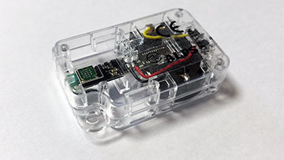

node-alps
===============

[[English (英語)](README.md)]

node-alps は、アルプス電気社製「[センサネットワークモジュール 開発キット](http://www.alps.com/j/iotsmart-network/index.html)」に BLE でアクセスするための node モジュールです。

[](imgs/alps_l.jpg)

アルプス電気社製「[センサネットワークモジュール 開発キット](http://www.alps.com/j/iotsmart-network/index.html)」は、モーションデータや環境データを取得するための多機能センサーモジュールです。このデバイスには、加速度センサー、磁気センサー、大気圧センサー、湿度センサー、温度センサー、UV センサー、照度センサーが搭載されています。node-alps は、設定変更、通知受信、アドバタイジングパケットのスキャンなどの API を提供します。

※ 本モジュールはアルプス電気社公式の node モジュールではありません。

## 依存関係

* [Node.js](https://nodejs.org/en/) 6 +
* [noble](https://www.npmjs.com/package/noble)

## インストール

```
$ cd ~
$ npm install noble
$ npm install node-alps
```

---------------------------------------
## 目次

* [クイックスタート](#Quick-Start)
  * [デバイスの発見と接続](#Quick-Start-1)
  * [環境系センサーのモニタリング](#Quick-Start-2)
  * [モーション系センサーのモニタリング](#Quick-Start-3)
  * [ビーコンの設定とモニタリング](#Quick-Start-4)
* [`Alps` オブジェクト](#Alps-object)
  * [`init()` メソッド](#Alps-init-method)
  * [`discover()` メソッド](#Alps-discover-method)
  * [`scartScan()` メソッド](#Alps-startScan-method)
  * [`stopScan()` メソッド](#Alps-stopScan-method)
  * [`onadvertisement` イベントハンドラ](#Alps-onadvertisement-event-handler)
* [`AlpsDevice` オブジェクト](#AlpsDevice-object)
  * [プロパティ](#AlpsDevice-properties)
  * [`ondisconnect` イベントハンドラ](#AlpsDevice-ondisconnect-event-handler)
  * [`onnotify` イベントハンドラ](#AlpsDevice-onnotify-event-handler)
  * [`connect()` メソッド](#AlpsDevice-connect-method)
  * [`disconnect()` メソッド](#AlpsDevice-disconnect-method)
  * [`isConnected()` メソッド](#AlpsDevice-isConnected-method)
  * [`setBeaconMode()` メソッド](#AlpsDevice-setBeaconMode-method)
  * [`startMonitor()` メソッド](#AlpsDevice-startMonitor-method)
  * [`stopMonitor()` メソッド](#AlpsDevice-stopMonitor-method)
  * [`getStatus()` メソッド](#AlpsDevice-getStatus-method)
  * [`getDeviceName()` メソッド](#AlpsDevice-getDeviceName-method)
  * [`setDeviceName()` メソッド](#AlpsDevice-setDeviceName-method)
* [`AlpsAdvertisement` オブジェクト](#AlpsAdvertisement-object)
  * [Normal Advertising モード](#AlpsAdvertisement-object-Normal)
  * [Sensor Beacon モード](#AlpsAdvertisement-object-Sensor)
  * [General Beacon モード](#AlpsAdvertisement-object-General)
* [リリースノート](#Release-note)
* [リファレンス](#References)
* [ライセンス](#License)

---------------------------------------
## <a id="Quick-Start">クイックスタート</a>

### <a id="Quick-Start-1">デバイスの発見と接続</a>

このサンプルコードでは、デバイスの発見方法、接続方法、切断方法を示します。

```JavaScript
// Alps コンストラクタ
const Alps = require('node-alps');
// Alps オブジェクトの生成
const alps = new Alps();
// AlpsDevice オブジェクトを格納する変数
let device = null;

// Alps オブジェクトの初期化
alps.init().then(() => {
  // デバイスの発見を開始
  return alps.discover({
    duration: 5000, // 最大 5 秒待つ
    quick: true     // 1 個でもデバイスを見つけたら終了
  });
}).then((device_list) => {
  // デバイスを発見できたかを確認
  if(device_list.length === 0) {
    throw new Error('デバイスが見つかりませんでした。');
  }
  // 発見したデバイスを表す AlpsDevice オブジェクト
  device = device_list[0];
  console.log('デバイスが見つかりました: ' + device.advertisement.localName);
  // デバイスに接続
  console.log('接続します...');
  return device.connect();
}).then(() => {
  console.log('接続しました。');
  /*--------------------------------------
  * ここからデバイスに対して操作が可能になります。
  * ----------------------------------- */
  // デバイスを切断
  console.log('切断します...');
  return device.disconnect();
}).then(() => {
  console.log('切断しました。');
  process.exit();
}).catch((error) => {
  console.error(error);
  process.exit();
});

```

本モジュールを使うためには、まず、`Alps` コンストラクタから [`Alps`](#Alps-object) オブジェクトを生成しなければいけません。上記コードでは、変数 `Alps` が [`Alps`](#Alps-object) オブジェクトに該当します。

[`Alps`](#Alps-object) オブジェクトは、[`init()`](#Alps-init-method) メソッドを呼び出すことで、利用可能になります。[`Alps`](#Alps-object) オブジェクトに実装されているメソッドは、すべて非同期となり、`Promise` オブジェクトを返します。

デバイスを操作するためには、[`Alps`](#Alps-object) オブジェクトの [`discover()`](#Alps-discover-method) メソッドを使って、デバイスを発見します。このメソッドは 2 つの引数を与えることができます。上記コードでは、発見するための待ちの時間を表す `duration` プロパティに `5000` (5 秒) を指定しています。また、`quick` プロパティに `true` を指定することで、デバイスが 1 個発見された時点で、`duraion` プロパティに指定した待ち時間を待たずに、処理を終了させます。

[`discover()`](#Alps-discover-method) メソッドは、デバイスが発見されると、`resolve()` 関数には、発見したデバイスを表す [`AlpsDevice`](#AlpsDevice-object) を格納した配列が与えられます。上記コードでは、発見したデバイスの 1 つを表す [`AlpsDevice`](#AlpsDevice-object) を、変数 `device` にセットしています。

この時点ではまだ該当のデバイスを操作することはできません。そのためには、[`connect()`](#AlpsDevice-connect-method) メソッドを使って接続しなければいけません。接続が完了したら、[`AlpsDevice`](#AlpsDevice-object) オブジェクトに実装されたその他のメソッドが利用できるようになります。

最後に、デバイスを切断するには、[`disconnect()`](#AlpsDevice-disconnect-method) メソッドを使います。

上記サンプルコードを実行すると、次のような結果が得られます。

```
デバイスが見つかりました: SNM00
接続します...
接続しました。
切断します...
切断しました。
```

### <a id="Quick-Start-2">環境系センサーのモニタリング</a>

デバイスにはさまざまなセンサーが内蔵されていますが、その計測結果をモニターする際には、2 つのモードがあります。一つは、環境系センサーのモニターモード、もう一つは、モーション系センサーのモニターモードです。ここでは、環境系センサーのモニターモードの使い方について解説します。環境系センサーは、大気圧センサー、湿度センサー、温度センサー、UV センサー、周辺光センサーが該当します。

下記サンプルコードでは、環境系センサーのモニターモードでモニタリングを開始し、その結果をコンソールに都度表示します。そして、30 秒後にモニター処理を停止して切断します。

```JavaScript
const Alps = require('node-alps');
const alps = new Alps();
let device = null;

alps.init().then(() => {
  return alps.discover({
    duration: 5000,
    quick: true
  });
}).then((device_list) => {
  if(device_list.length === 0) {
    throw new Error('デバイスが見つかりませんでした。');
  }
  device = device_list[0];
  console.log('デバイスが見つかりました: ' + device.advertisement.localName);
  console.log('接続します...');
  return device.connect();
}).then(() => {
  console.log('接続しました。');
  // 環境系センサーのモニター開始処理
  console.log('環境系センサーのモニターの準備を開始します...');
  return device.startMonitor({
    mode    : 0, // 環境系センサーモニターモード
    interval: 1  // レポート間隔 (秒)
  });
}).then(() => {
  console.log('モニターの準備ができました。');
  console.log('モニターを開始します。');
  // イベントリスナーをセット
  device.onnotify = (data) => {
    console.log(JSON.stringify(data, null, '  '));
  };

  // 30 秒後にモニターを停止して切断
  setTimeout(() => {
    // モニター停止処理
    device.stopMonitor().then(() => {
      console.log('モニターを停止しました。')
      return device.disconnect();
    }).then(() => {
      console.log('切断しました。');
      process.exit();
    }).catch((error) => {
      console.error(error);
      process.exit();
    });
  }, 30000);

}).catch((error) => {
  console.error(error);
  process.exit();
});
```

[`connect()`](#AlpsDevice-connect-method) メソッドでデバイスに接続した後、[`startMonitor()`](#AlpsDevice-startMonitor-method) メソッドを使って、該当のデバイスに対して、センサー計測情報のレポートを要求します。

[`startMonitor()`](#AlpsDevice-startMonitor-method) メソッドには 2 つのパラメータを指定することができます。パラメータ `mode` はモニター対象となるセンサーグループを表します。環境系センサーの場合は、`0` を指定します。パラメータ `interval` はデバイスからのレポート間隔を表し、単位は秒です。上記コードでは、1 秒間隔でレポートするよう、指定しています。

センサー計測情報のレポートの要求が完了したら、そのレポートを受信するためのコールバック関数を [`onnotify`](#AlpsDevice-onnotify-event-handler) イベントハンドラにセットします。レポートを受信するたびに、そのコールバック関数が呼び出され、その関数には計測結果を格納したオブジェクトが引数として与えられます。

モニターを停止するためには、[`stopMonitor()`](#AlpsDevice-stopMonitor-method) メソッドを呼び出します。

上記コードを実装すると、次のような結果がコンソールに出力されます。

```
デバイスが見つかりました: SNM00
接続します...
接続しました。
環境系センサーのモニターの準備を開始します...
モニターの準備ができました。
モニターを開始します。
{
  "pressure": 997.0392919813839,
  "humidity": 52.734375,
  "temperature": 24.2,
  "uv": 0.05154639175257732,
  "ambient": 150.86206896551724,
  "ambientLed": 260.10701545778835,
  "ambientFluorescent": 342.86833855799375,
  "timeStamp": {
    "day": 7,
    "month": 5,
    "year": 2017,
    "millisecond": 0,
    "second": 6,
    "minute": 4,
    "hour": 23
  },
  "dataIndex": 31
}

...

モニターを停止しました。
切断しました。
```

### <a id="Quick-Start-3">モーション系センサーのモニタリング</a>

デバイスにはさまざまなセンサーが内蔵されていますが、その計測結果をモニターする際には、2 つのモードがあります。一つは、環境系センサーのモニターモード、もう一つは、モーション系センサーのモニターモードです。ここでは、モーション系センサーのモニターモードの使い方について解説します。モーション系センサーは、加速度センサー、地磁気センサーが該当します。

前述の環境系センサーのモニターのコードの [`startMonitor()`](#AlpsDevice-startMonitor-method) メソッドに与えるパラメータを変えるだけで、モーション系センサーをモニターすることができます。

```JavaScript
return device.startMonitor({
  mode    : 1,   // モーション系センサーモニターモード
  interval: 100  // レポート間隔 (秒)
});
```

パラメータ `mode` はモニター対象となるセンサーグループを表します。モーション系センサーの場合は、`1` を指定します。パラメータ `interval` はデバイスからのレポート間隔を表し、単位は**ミリ秒**です。環境系センサーモニターモードでは、その単位は秒でしたが、モーション系センサーモニターモードではミリ秒になりますので、注意してください。上記コードでは、100 ミリ秒間隔でレポートするよう、指定しています。

上記コードを実装すると、次のような結果が連続してコンソールに出力されます。

```
{
  "geoMagnetic": {
    "x": -14.7,
    "y": -34.5,
    "z": 116.85
  },
  "acceleration": {
    "x": 0.107666015625,
    "y": 0.01318359375,
    "z": -1.03125
  },
  "timeStamp": {
    "millisecond": 800,
    "second": 43,
    "minute": 33,
    "hour": 20
  },
  "dataIndex": 41
}
```

### <a id="Quick-Start-4">ビーコンの設定とモニタリング</a>

ビーコンには、"Normal Advertising"、"Sensor Beacon"、"General Beacon" という 3 つのモードがあり、本モジュールは、すべてのモードへの変更および受信をサポートしています。以下のサンプルでは、デバイスに接続後、ビーコンモードを "Sensor Beacon" モードに変更し、切断してから、ビーコンをモニターします。

```JavaScript
const Alps = require('node-alps');
const alps = new Alps();
let device = null;

alps.init().then(() => {
  return alps.discover({
    duration: 5000,
    quick: true
  });
}).then((device_list) => {
  if(device_list.length === 0) {
    throw new Error('デバイスが見つかりませんでした。');
  }
  device = device_list[0];
  console.log('デバイスが見つかりました: ' + device.advertisement.localName);
  console.log('接続します...');
  return device.connect();
}).then(() => {
  console.log('接続しました。');
  // センサービーコンモードに変更
  console.log('ビーコンモードを設定中...');
  return device.setBeaconMode({
    mode  : 1, // センサービーコンモード
    format: 0  // 0: 環境系センサー, 1: モーション系センサー
  });
}).then((data) => {
  console.log('ビーコンモードを設定しました。');
  // 切断
  return device.disconnect();
}).then(() => {
  console.log('切断しました。');

  // ビーコンのモニターを開始
  console.log('ビーコンのモニターを開始します。');
  alps.startScan();

  // ビーコン受信用のコールバック関数をセット
  alps.onadvertisement = (ad) => {
    console.log(JSON.stringify(ad, null, '  '));
  };

  // 10 秒後にビーコンのモニターを停止
  setTimeout(() => {
    alps.stopScan();
    process.exit();
  }, 10000);

}).catch((error) => {
  console.error(error);
  process.exit();
});
```

ビーコンモードを変更するには、[`setBeaconMode()`](#AlpsDevice-setBeaconMode-method) メソッドを使います。パラメータ `mode` に 1 をセットすると、"Sensor Beacon" モードになります。"Sensor Beacon" モードには 2 つのフォーマットがあります。一つは主に環境センサー計測値がセットされるフォーマットで、もう一つは、主にモーション系センサー計測値がセットされるフォーマットです。上記コードでは、環境系センサーの計測値がセットされるフォーマットを指定しています。

ビーコンをキャッチするためには、事前にデバイスとの接続を切断する必要があります。切断後に、[`startScan()`](#Alps-startScan-method) メソッドを使って、ビーコンのモニターを開始することができます。ビーコンのデータを取得するためには、[`onnotify`](#AlpsDevice-onnotify-event-handler) イベントハンドラにコールバック関数をセットします。ビーコンを受信するたびに、このコールバック関数が呼び出されます。その際に、ビーコンのデータを格納したオブジェクトが引数に与えられます。

最後に、ビーコンのモニターを停止するには、[`stopScan()`](#Alps-stopScan-method) メソッドを使います。なお、[`startScan()`](#Alps-startScan-method) メソッドと [`stopScan()`](#Alps-stopScan-method) メソッドは、いずれも非同期処理ではないため、他のメソッドとは異なり、`Promise` オブジェクトを返しません。

上記コードを実行すると、次のような結果がビーコン受信の都度コンソールに表示されます。

```
{
  "id": "28a183e158f3",
  "uuid": "28a183e158f3",
  "address": "28:a1:83:e1:58:f3",
  "localName": "SNM00",
  "rssi": -59,
  "companyId": "0272",
  "acceleration": {
    "x": 0.0791015625,
    "y": -0.037353515625,
    "z": -1.027587890625
  },
  "pressure": 997.1705195696956,
  "humidity": 48.28125,
  "temperature": 25.06,
  "uv": 0.07731958762886597,
  "ambientLight": 86.20689655172413
}
```

---------------------------------------
## <a id="Alps-object">`Alps` オブジェクト</a>

node-alps を利用するためには、まず、次のように node-alps モジュールをロードします。

```JavaScript
const Alps = require('node-alps');
```

上記コードから `ALps` コンストラクタが得られます。この `Alps` コンストラクタから、次のように、 `Alps` オブジェクトを生成します。

```JavaScript
const alps = new Alps();
```

`Alps` コンストラクタは、オプションで引数を受け取ります。もし引数を与える場合は、以下のプロパティを持ったハッシュオブジェクトでなければいけません。

プロパティ | 型    | 必須 | 説明
:--------|:-------|:-----|:-----------
`noble`  | Noble  | 任意 | [`noble`](https://www.npmjs.com/package/noble) モジュールの `Noble` オブジェクト

node-alps モジュールは、BLE でデバイスと通信を行うために、[`noble`](https://www.npmjs.com/package/noble) モジュールを使います。もし、noble モジュールを使って他の BLE デバイスに接続するのであれば、自身で `Noble` オブジェクトを生成し、このモジュールに引き渡すことができます。もし `Noble` オブジェクトが引き渡さなければ、node-alps モジュールは、自動的に `Noble` オブジェクトを生成します。

次のコードは、`Alps` コンストラクターに `Noble` オブジェクトを引き渡す方法を示しています。

```JavaScript
const noble = require('noble');
const Alps = require('node-alps');
const alps = new Alps({'noble': noble});
```

### <a id="Alps-init-method">init() メソッド</a>

A `Alps` オブジェクトは生成した時点ではまだ利用することができません。利用前に、`init()` メソッドを使って初期化しなければいけません。

```JavaScript
alps.init().then(() => {
  // ここから Alps オブジェクトに実装されたメソッドを使うことができます。
}).catch((error) => {
  console.error(error);
});
```

`init()` メソッドは `Promise` オブジェクトを返します。`Alps` オブジェクトの初期化が成功したら、以降で説明する各種メソッドを呼び出すことが可能となります。

### <a id="Alps-discover-method">discover(*[params]*) メソッド</a>

`discover()` メソッドは、[アルプス電気社センサネットワークモジュール](http://www.alps.com/j/iotsmart-network/index.html)を発見します。このメソッドは `Promise` オブジェクトを返します。このメソッドには次のパラメーターを格納したハッシュオブジェクトを引き渡すことができます。

プロパティ    | 型      | 必須 | 説明
:------------|:--------|:-----|:------------
`duration`   | Number  | 任意 | 発見処理の待ち時間をミリ秒で指定します。デフォルト値は 5000 (5 秒) です。
`quick`      | Boolean | 任意 | `true` を指定したら、最初にデバイスを発見した時点で、発見処理を終了し、`duration` の値に関わらず、`resolve()` 関数が呼び出されます。デフォルト値は `false` です。
`idFilter`   | String | 任意 | ここに指定した値が、デバイスの ID (`id`) に前方一致するもののみを発見の対象とし、それ以外は無視します。
`name`       | String | 任意 | デバイスのローカル名を指定します。アドバタイズパケットのローカル名と完全一致したものが発見対象となります。デフォルト値は `SNM00` です。もしローカル名を変更すると、そのデバイスを発見できません。その場合に、このパラメータに変更後のローカル名を指定することで、デバイスを発見できるようにします。

以下のサンプルでは、the `duration` を `discover()` メソッドに引き渡して、発見処理を 10 秒にしています。

```JavaScript
alps.init().then(() => {
  return alps.discover({
    duration: 10000
  });
}).then((device_list) => {
  // Do something...
}).catch((error) => {
  console.error(error);
});
```

`discover()` メソッドは、発見処理を終えると、発見したデバイスを表す [`AlpsDevice`](#AlpsDevice-object) オブジェクトを格納した `Array` オブジェクトを `resolve()` 関数に引き渡します。もし、1 つ発見したらすぐに発見処理を終了して結果を得たいなら、`quick` プロパティに `true` をセットします。

```JavaScript
alps.init().then(() => {
  return alps.discover({
    duration: 10000,
    quick: true
  });
}).then((device_list) => {
  // Do something...
}).catch((error) => {
  console.error(error);
});
```
### <a id="Alps-startScan-method">scartScan(*[params]*) メソッド</a>

`startScan()` メソッドは、デバイスから送出されるアドバタイズパケットのスキャンを開始します。このメソッドは、次のプロパティを持つハッシュオブジェクトを引数に取ります。

プロパティ    | 型     | 必須 | 説明
:------------|:-------|:-----|:------------
`idFilter`   | String | 任意 | ここに指定した値が、デバイスの ID (`id`) に前方一致するもののみを発見の対象とし、それ以外は無視します。。
`name`       | String | 任意 | デバイスのローカル名 (デバイス名) を指定します。アドバタイズパケットのローカル名と完全一致したものが発見対象となります。デフォルト値は `SNM00` です。もしローカル名を変更すると、そのデバイスを発見できません。その場合に、このパラメータに変更後のローカル名を指定することで、デバイスを発見できるようにします。

パケットを受信する都度、[`onadvertisement`](#Alps-onadvertisement-event-handler) イベントハンドラにセットしたコールバック関数が呼び出されます。このコールバック関数には、[`AlpsAdvertisement`](#AlpsAdvertisement-object) オブジェクトが引き渡されます。

```JavaScript
// アドバタイズパケット受信のコールバック関数をセット
alps.onadvertisement = (ad) => {
  console.log(JSON.stringify(ad, null, '  '));
};

// スキャン開始
alps.startScan();

// 60 秒後にスキャン停止
setTimeout(() => {
  alps.stopScan();
  process.exit();
}, 60000);
```

スキャンの停止には、[`stopScan()`](#Alps-stopScan-method) メソッドを使います。なお、`startScan()` および `stopScan()` メソッドはいずれも非同期処理ではないため、他のメソッドとは異なり、`Promise` オブジェクトは返しません。

デバイスの電源を入れた直後で何も設定を変更していなければ、次のようなビーコンデータが連続して得られます。

```
{
  "id": "28a183e158f3",
  "uuid": "28a183e158f3",
  "address": "28:a1:83:e1:58:f3",
  "localName": "SNM00",
  "rssi": -59
}
```

ビーコンのデータは、ビーコンモードによって異なります。詳細は [`setBeaconMode()`](#AlpsDevice-setBeaconMode-method) メソッド、および、[`AlpsAdvertisement`](#AlpsAdvertisement-object) オブジェクトを参照してください。

### <a id="Alps-stopScan-method">stopScan() メソッド</a>

`stopScan()` メソッドは、デバイスから送出されるアドバタイズパケットのスキャンを停止します。詳細は [`startScan()`](#Alps-startScan-method) メソッドを参照してください。

### <a id="Alps-onadvertisement-event-handler">`onadvertisement` イベントハンドラ</a>

`onadvertisement` プロパティにコールバック関数をセットすると、アドバタイズパケットのスキャンがアクティブな間 ([`startScan()`](#Alps-startScan-method) メソッドが呼び出されてから [`stopScan()`](#Alps-stopScan-method) メソッドが呼び出されるまで)、アドバタイズパケットを受信する都度、そのコールバック関数が呼び出されます。

詳細は [`startScan()`](#Alps-startScan-method) メソッドを参照してください。

---------------------------------------
## <a id="AlpsDevice-object">`AlpsDevice` オブジェクト</a>

`AlpsDevice` オブジェクトは、[`Alps`](#Alps-object) の [`discover()`](#Alps-discover-method) メソッドを呼び出すことによって発見されたデバイスを表します。

### <a id="AlpsDevice-properties">プロパティ</a>

`AlpsDevice` オブジェクトには、以下のプロパティが実装されています。

プロパティ        | 型     | 説明 
:---------------|:---------|-----------------------------
`advertisement` | [`AlpsAdvertisement`](#AlpsAdvertisement-object) | このオブジェクトは、デバイスが発見されたときに受信したアドバタイズパケットを表します。詳細は、 [`AlpsAdvertisement`](#AlpsAdvertisement-object) オブジェクトを参照してください。
`connected` (*廃止予定*) | Boolean  | デバイスが接続しているとき、この値は `true` になり、そうでなければ、`false` になります。*このプロパティは**廃止予定**です。接続性を知りたいなら、[`isConnected()`](#AlpsDevice-isConnected-method) メソッドを使ってください。*
[`ondisconnect`](#AlpsDevice-ondisconnect-event-handler) | Function | このプロパティにセットされた関数は、デバイスが切断されたときに呼び出されます。詳細は、[`ondisconnect`](#AlpsDevice-ondisconnect-event-handler) イベントハンドラを参照してください。
[`onnotify`](#AlpsDevice-onnotify-event-handler) | Function | このプロパティにセットされた関数は、センサー情報を受信した都度に呼び出されます。詳細は、[`onnotify`](#AlpsDevice-onnotify-event-handler) イベントハンドラを参照してください。

### <a id="AlpsDevice-ondisconnect-event-handler">`ondisconnect` イベントハンドラ</a>

`ondisconnect` は、デバイスが切断されたときに呼び出されるイベントハンドラです。

```JavaScript
device.ondisconnect = (reason) => {
  console.log('切断されました。');
  console.dir(reason);
};
```

デバイスとの接続が切断されると、次のような結果を表示します。

```
Disconnected.
{ wasClean: false }
```

`ondisconnect` にセットされたコールバック関数には、切断理由を表すプロパティ `wasClean` を含んだオブジェクトが引き渡されます。`wasClean` プロパティの値が `ture` の場合は、[`disconnect()`](#AlpsDevice-disconnect-method) メソッドによって切断されたことを表します。もし `false` の場合は、意図せぬ切断を表します。

環境によっては、`ondisconnect` は意図せぬ切断の場合のみにしか呼び出されませんので注意してください。つまり、このコールバック関数が呼び出されたとき、`wasClean` は常に `false` であり、それは意図せぬ切断を意味していることになります。したがって、`disconnect()` メソッドの呼び出しによる切断のトリガーとして `ondisconnect` イベントハンドラを使うことは推奨されません。また、実際に `ondisconnect` イベントハンドラを使う際には、念のために、`wasClean` の値が `false` であることを確認することを推奨します。

### <a id="AlpsDevice-onnotify-event-handler">`onnotify` イベントハンドラ</a>

`onnotify` は、[`startMonitor()`](#AlpsDevice-startMonitor-method) メソッドによってセンサー情報のモニターが開始された後、デバイスから送られてくるセンサー情報の通知を受け取るためのイベントハンドラです。詳細は、[`startMonitor()`](#AlpsDevice-startMonitor-method) メソッドを参照してください。

### <a id="AlpsDevice-connect-method">connect() メソッド</a>

`connect()` メソッドは、デバイスとのコネクションを確立します (ペアリング)。このメソッドは `Promise` オブジェクトを返します。

以下のサンプルコードは、デバイスとのコネクションを確立してから、最後にコネクションを切断します。

```JavaScript
device.connect().then(() => {
  console.log('接続しました。');
  /*--------------------------------------
  * ここからデバイスに対して操作が可能になります。
  * ----------------------------------- */
  // デバイスを切断
  return device.disconnect();
}).then(() => {
  console.log('切断しました。');
  process.exit();
}).catch((error) => {
  console.error(error);
  process.exit();
});
```

### <a id="AlpsDevice-disconnect-method">disconnect() メソッド</a>

`disconnect()` メソッドは、デバイスとの接続を切断します。このメソッドは `Promise` オブジェクトを返します。詳細は [`connect()`](#AlpsDevice-connect-method) メソッドを参照してください。

なお、デバイスに対する操作が終わったら、必ず `disconnect()` メソッドを使ってコネクションを切断してください。もしコネクションを切断せずにスクリプトが終了してしまうと、しばらくの間、そのデバイスに接続できなくなる可能性がありますので注意してください。もし接続に失敗するようであれば、デバイスの電源を OFF にしてから、再度、ON にしてみてください。

### <a id="AlpsDevice-isConnected-method">isConnected() メソッド</a>

`isConnected()` メソッドは、デバイスに接続しているかどうかを返します。デバイスが接続済みであれば `true` を、そうでなければ `false` を返します。

```javascript
if(device.isConnected()) {
  console.log('Connected.');
} else {
  console.log('Not connected.');
}
```

### <a id="AlpsDevice-setBeaconMode-method">setBeaconMode(*params*) メソッド</a>

`setBeaconMode()` メソッドは、デバイスが発するビーコン (アドバタイズパケット) のモードを切り替えます。以下のサンプルコードは、ビーコンモードを Sensor Beacon モードに切り替えます。

このメソッドの具体的なコードの書き方は、クイックスタートの「[ビーコンの設定とモニタリング](#Quick-Start-4)」を参照してください。

このメソッドには、設定パラメータを持ったハッシュオブジェクトを引数に与えますが、切り替えたいモードによって、以下の通り、パラメータが異なります。

各モードでデバイスから送信されるビーコンデータの詳細は、[`AlpsAdvertisement`](#AlpsAdvertisement-object) オブジェクトを参照してください。

#### Normal Advertising モード

Normal Advertising モードは、アドバタイズパケットに Manufacturer Specific Data を持たないモードです。これは、デバイスの電源を入れた際のデフォルトのモードです。

プロパティ    | 型     | 必須 | 説明
:------------|:-------|:-----|:------------
`mode`       | Number | 必須 | `0` 固定
`interval`   | Number | 任意 | アドバタイズパケットの送出間隔をミリ秒で指定します。指定可能な値の範囲は 30 ～ 10000 です。指定がなければ、100 (ミリ秒) がセットされます。

#### Sensor Beacon モード

Sensor Beacon モードは、ビーコンデータにデバイスのセンサーの計測値を含んだモードです。

プロパティ    | 型     | 必須 | 説明
:------------|:-------|:-----|:------------
`mode`       | Number | 必須 | `1` 固定
`interval`   | Number | 任意 | アドバタイズパケットの送出間隔をミリ秒で指定します。指定可能な値の範囲は 30 ～ 10000 です。指定がなければ、100 (ミリ秒) がセットされます。
`format`     | Number | 任意 | パケットのフォーマットを指定します。`0` は環境系センサー情報フォーマット、`1` はモーション系センサー情報フォーマットを意味します。
`accelerationRange` | Number | 任意 |  加速度センサーの計測範囲を指定します。指定可能な値は `2`, `4`, `8`, `12`, `16` です。たとえば、`2` を指定すると、±2G の範囲で計測します。指定がなければ `2` がセットされます。

#### General Beacon モード

General Beacon モードは iBeacon 相当のビーコンを発するモードです。

プロパティ    | 型     | 必須 | 説明
:------------|:-------|:-----|:------------
`mode`       | Number | 必須 | `2` 固定
`uuid`       | String | 任意 | UUID を指定します。指定がなければ `00000000-0000-0000-0000000000000000` がセットされます。
`major`      | Number | 任意 | Major 番号を指定します。指定可能な値は 0 ～ 65535 です。指定がなければ 0 がセットされます。
`manor`      | Number | 任意 | Minor 番号を指定します。指定可能な値は 0 ～ 65535 です。指定がなければ 0 がセットされます。

### <a id="AlpsDevice-startMonitor-method">startMonitor(*[params]*) メソッド</a>

`startMonitor()` メソッドは、デバイスのセンサー情報のモニターを開始します。このメソッドは `Promise` オブジェクトを返します。

センサー情報のモニターは、2 つのモードがあります。一つは環境系センサーモードです。このモードでは、大気圧センサー、湿度センサー、温度センサー、UV センサー、照度センサーの計測値をモニターします。もひとつのモードはモーション系センサーモードです。このモードでは、地磁気センサーと加速度センサーの計測値をモニターします。

これらのモードでは、計測するセンサーの種類が違うことに加え、計測間隔も異なります。環境系センサーモードでは秒単位で間隔を指定するのに対し、モーション系ではミリ秒単位で間隔を指定します。

このメソッドには、パラメータ値を持ったハッシュオブジェクトを引数に与えますが、モードによって、このメソッドに与えるパラメーターが異なります。また、デバイスからのセンサー計測結果通知を受信すると、[`onnotify`](#AlpsDevice-onnotify-event-handler) イベントハンドラにセットされたコールバック関数が非同期に呼び出され、計測結果のデータが引き渡されますが、そのデータもモードによって異なります。

#### 環境系センサーモードのパラメータ

プロパティ    | 型     | 必須 | 説明
:------------|:-------|:-----|:------------
`mode`       | Number | 必須 | `0` 固定
`interval`   | Number | 任意 | 計測結果の送出間隔を秒で指定します。指定可能な値の範囲は 1 ～ 65535 です。指定がなければ、1 (秒) がセットされます。

```JavaScript
device.startMonitor({
  mode    : 0, // 環境系センサーモード
  interval: 1  // 送信間隔 (秒)
}).then(() => {
  device.onnotify = (data) => {
    console.log(JSON.stringify(data, null, '  '));
  };
}).catch((error) => {
  console.error(error);
});
```

受信データは、以下の通りです。

プロパティ            | 型     | 説明 
:--------------------|:-------|-----------------------------
`pressure`           | Number | 大気圧 (hPa)
`humidity`           | Number | 湿度 (%RH)
`temperature`        | Number | 温度 (degC)
`uv`                 | Number | UV (mW/cm^2)
`ambient`            | Number | 太陽光またはハロゲンランプを光源とした場合の照度 (Lx)
`ambientLed`         | Number | LED を光源とした場合の照度 (Lx)
`ambientFluorescent` | Number | 蛍光灯を光源とした場合の照度 (Lx)
`timeStamp`          | Object | 計測時間
 +- `day`            | Number | 日
 +- `month`          | Number | 月
 +- `year`           | Number | 西暦
 +- `millisecond`    | Number | ミリ秒
 +- `second`         | Number | 秒
 +- `minute`         | Number | 分
 +- `hour`           | Number | 時
`dataIndex`          | Number | センサ計測シーケンス番号

```JavaScript
{
  "pressure": 996.4881361104754,
  "humidity": 51.65625,
  "temperature": 24.04,
  "uv": 0.02577319587628866,
  "ambient": 129.3103448275862,
  "ambientLed": 222.94887039239,
  "ambientFluorescent": 293.8871473354232,
  "timeStamp": {
    "day": 8,
    "month": 5,
    "year": 2017,
    "millisecond": 0,
    "second": 10,
    "minute": 4,
    "hour": 1
  },
  "dataIndex": 29
}
```

#### モーション系センサーモードのパラメータ

プロパティ           | 型     | 必須 | 説明
:-------------------|:-------|:-----|:------------
`mode`              | Number | 必須 | `1` 固定
`interval`          | Number | 任意 | 計測結果の送出間隔をミリ秒で指定します。指定可能な値の範囲は 10 ～ 999 です。指定がなければ、200 (ミリ秒) がセットされます。
`accelerationRange` | Number | 任意 | 加速度センサーの計測範囲を指定します。指定可能な値は `2`, `4`, `8`, `12`, `16` です。たとえば、`2` を指定すると、±2G の範囲で計測します。指定がなければ `2` がセットされます。

パラメータ `interval` の単位がモードによって違う点に注意してください。環境系センサーモードでは単位が秒ですが、モーション系センサーモードでは単位はミリ秒となります。

```JavaScript
device.startMonitor({
  mode             : 1,   // モーション系センサーモード
  interval         : 200, // 送信間隔 (ミリ秒)
  accelerationRange: 2    // 加速度センサー計測範囲 (G)
}).then(() => {
  device.onnotify = (data) => {
    console.log(JSON.stringify(data, null, '  '));
  };
}).catch((error) => {
  console.error(error);
});
```

受信データは、以下の通りです。

プロパティ        | 型     | 説明 
:----------------|:-------|-----------------------------
`geoMagnetic`    | Object | 地磁気センサーの情報
+- `x`           | Number | x 軸地磁気 (uT)
+- `y`           | Number | y 軸地磁気 (uT)
+- `z`           | Number | z 軸地磁気 (uT)
`acceleration`   | Object | 加速度センサーの情報
+- `x`           | Number | x 軸加速度 (G)
+- `y`           | Number | y 軸加速度 (G)
+- `z`           | Number | z 軸加速度 (G)
`timeStamp`      | Object | 計測時間
+- `millisecond` | Number | ミリ秒
+- `second`      | Number | 秒
+- `minute`      | Number | 分
+- `hour`        | Number | 時
`dataIndex`      | Number | センサ計測シーケンス番号

```JavaScript
{
  "geoMagnetic": {
    "x": -9,
    "y": -31.799999999999997,
    "z": 107.85
  },
  "acceleration": {
    "x": 0.10399882818221766,
    "y": -0.014647722279185586,
    "z": -1.022411015087154
  },
  "timeStamp": {
    "millisecond": 600,
    "second": 11,
    "minute": 58,
    "hour": 0
  },
  "dataIndex": 147
}
```

### <a id="AlpsDevice-stopMonitor-method">stopMonitor() メソッド</a>

`stopMonitor()` メソッドは、[`startMonitor()`](#AlpsDevice-startMonitor-method) メソッドによって開始されたセンサー情報モニターを停止します。このメソッドは `Promise` オブジェクトを返します。

```JavaScript
device.stopMonitor().then(() => {
  console.log('モニターを停止しました。');
}).catch((error) => {
  console.error(error);
});
```

### <a id="AlpsDevice-getStatus-method">getStatus() メソッド</a>

`getStatus()` メソッドは、バッテリー電圧、エラー情報などのデバイスの状態を取得します。このメソッドは `Promise` オブジェクトを返します。

```JavaScript
device.getStatus().then((data) => {
  console.log(JSON.stringify(data, null, '  '));
}).catch((error) => {
  console.error(error);
});
```

上記コードは、以下のような結果を出力します：

```JavaScript
{
  "error": {
    "pressure": false,
    "uv": false,
    "humidity": false,
    "magnetic": false,
    "acceleration": false
  },
  "rssi": -35,
  "battery": 3139,
  "memFull": false,
  "ack": 1
}
```

受信データは、以下の通りです。

プロパティ         | 型      | 説明
:-----------------|:--------|-----------------------------
`error`           | Object  | 
+- `pressure`     | Boolean | 気圧異常 (異常なら `true`、正常なら `false` がセットされます)
+- `uv`           | Boolean | UV 異常 (異常なら `true`、正常なら `false` がセットされます)
+- `humidity`     | Boolean | 湿度異常 (異常なら `true`、正常なら `false` がセットされます)
+- `magnetic`     | Boolean | 地磁気異常 (異常なら `true`、正常なら `false` がセットされます)
+- `acceleration` | Boolean | 加速度異常 (異常なら `true`、正常なら `false` がセットされます)
`rssi`            | Number  | モジュール側の受信 RSSI (単位: dBm)
`battery`         | Number  | バッテリ電圧 (単位: mV)
`memFull`         | Boolean | 内部メモリフルフラグ (フルなら `true`、そうでなければ `false` がセットされます)
`ack`             | Number  | コマンドが正常に受け付けられたなら `1` (ACK)、コマンドの受付が許可されなかったら `2` (NACK)、それ以外(自動発行) なら `0` がセットされます。

### <a id="AlpsDevice-getDeviceName-method">getDeviceName() メソッド</a>

`getDeviceName()` メソッドは、デバイス名 (ローカル名) を取得します。このメソッドは `Promise` オブジェクトを返します。

```JavaScript
device.getDeviceName().then((data) => {
  console.log(JSON.stringify(data, null, '  '));
}).catch((error) => {
  console.error(error);
});
```

上記コードは、以下のような結果を出力します：

```javascript
{
  "deviceName": "SNM00"
}
```

受信データは、以下の通りです。

プロパティ         | 型      | 説明
:-----------------|:--------|-----------------------------
`deviceName`      | String  | デバイス名 (ローカル名)

### <a id="AlpsDevice-setDeviceName-method">setDeviceName(*prams*) メソッド</a>

`setDeviceName()` メソッドは、デバイス名 (ローカル名) をセットします。このメソッドは `Promise` オブジェクトを返します。このメソッドは、次のプロパティを持つハッシュオブジェクトを引数に取ります。

プロパティ    | 型     | 必須 | 説明
:------------|:-------|:-----|:------------
`deviceName` | String | 必須 | デバイス名 (ローカル名)。半角英数 1 文字～ 18 文字。

```JavaScript
device.setDeviceName({deviceName: 'SNM01'}).then(() => {
  console.log('Success');
}).catch((error) => {
  console.error(error);
});
```

---------------------------------------
## <a id="AlpsAdvertisement-object">`AlpsAdvertisement` オブジェクト</a>

`AlpsAdvertisement` オブジェクトは、デバイスが発するアドバタイズパケットのデータを表します。アドバタイズパケットのデータは、ビーコンモードによって異なります。

### <a id="AlpsAdvertisement-object-Normal">Normal Advertising モード</a>

プロパティ          | 型     | 説明 
:------------------|:-------|-----------------------------
`id`               | String | デバイスの ID
`uuid`             | String | デバイスの UUID
`address`          | String | デバイスのアドレス
`localName`        | String | デバイスのローカル名 (デバイス名)
`rssi`             | Number | RSSI

```JavaScript
{
  "id": "28a183e158f3",
  "uuid": "28a183e158f3",
  "address": "28:a1:83:e1:58:f3",
  "localName": "SNM00",
  "rssi": -59
}
```

### <a id="AlpsAdvertisement-object-Sensor">Sensor Beacon モード</a>

Sensor Beacon モードには 2 つのフォーマットがあります。ひとつは、主に環境系センサーの情報を格納したフォーマット、もうひとつは、主にモーション系センサーの情報を格納したフォーマットです。

#### 環境系センサーフォーマット

プロパティ            | 型     | 説明 
:--------------------|:-------|-----------------------------
`id`                 | String | デバイスの ID
`uuid`               | String | デバイスの UUID
`address`            | String | デバイスのアドレス
`localName`          | String | デバイスのローカル名 (デバイス名)
`rssi`               | Number | RSSI
`companyId`          | String | Bluetooth SIG に登録された企業 ID (`0272` 固定)
`acceleration`       | Object | 加速度センサーの情報
+- `x`               | Number | x 軸加速度 (G)
+- `y`               | Number | y 軸加速度 (G)
+- `z`               | Number | z 軸加速度 (G)
`pressure`           | Number | 大気圧 (hPa)
`humidity`           | Number | 湿度 (%RH)
`temperature`        | Number | 温度 (degC)
`uv`                 | Number | UV (mW/cm^2)
`ambient`            | Number | 太陽光またはハロゲンランプを光源とした場合の照度 (Lx)
`ambientLed`         | Number | LED を光源とした場合の照度 (Lx)
`ambientFluorescent` | Number | 蛍光灯を光源とした場合の照度 (Lx)

```JavaScript
{
  "id": "28a183e158f3",
  "uuid": "28a183e158f3",
  "address": "28:a1:83:e1:58:f3",
  "localName": "SNM00",
  "rssi": -59,
  "companyId": "0272",
  "acceleration": {
    "x": 0.09228515625,
    "y": -0.002197265625,
    "z": -1.02685546875
  },
  "pressure": 997.0130464637217,
  "humidity": 51.375,
  "temperature": 24.2,
  "uv": 0,
  "ambient": 150.86206896551724,
  "ambientLed": 260.10701545778835,
  "ambientFluorescent": 342.86833855799375
}
```

#### モーション系センサーフォーマット

プロパティ      | 型     | 説明 
:--------------|:-------|-----------------------------
`id`           | String | デバイスの ID
`uuid`         | String | デバイスの UUID
`address`      | String | デバイスのアドレス
`localName`    | String | デバイスのローカル名 (デバイス名)
`rssi`         | Number | RSSI
`companyId`    | String | Bluetooth SIG に登録された企業 ID (`0272` 固定)
`acceleration` | Object | 加速度センサーの情報
+- `x`         | Number | x 軸加速度 (G)
+- `y`         | Number | y 軸加速度 (G)
+- `z`         | Number | z 軸加速度 (G)
`geoMagnetic`  | Object | 地磁気センサーの情報
+- `x`         | Number | x 軸地磁気 (uT)
+- `y`         | Number | y 軸地磁気 (uT)
+- `z`         | Number | z 軸地磁気 (uT)
`pressure`     | Number | 大気圧 (hPa)

```JavaScript
{
  "id": "28a183e158f3",
  "uuid": "28a183e158f3",
  "address": "28:a1:83:e1:58:f3",
  "localName": "SNM00",
  "rssi": -59,
  "companyId": "0272",
  "acceleration": {
    "x": 0.10546875,
    "y": -0.01611328125,
    "z": -1.027587890625
  },
  "geoMagnetic": {
    "x": -8.85,
    "y": -30.45,
    "z": 107.7
  },
  "pressure": 997.0130464637217
}
```

### <a id="AlpsAdvertisement-object-General">General Beacon モード</a>

プロパティ      | 型     | 説明 
:--------------|:-------|-----------------------------
`id`           | String | デバイスの ID
`uuid`         | String | iBeacon の UUID
`address`      | String | デバイスのアドレス
`localName`    | String | デバイスのローカル名 (デバイス名)
`rssi`         | Number | RSSI
`companyId`    | String | Bluetooth SIG に登録された企業 ID (`0272` 固定)
`major`        | Number | iBeacon の Major
`minor`        | Number | iBeacon の Minor

```JavaScript
{
  "id": "28a183e158f3",
  "uuid": "00000000-0000-0000-0000000000000000",
  "address": "28:a1:83:e1:58:f3",
  "localName": "SNM00",
  "rssi": -59,
  "companyId": "0272",
  "major": 0,
  "minor": 0
}
```

---------------------------------------
## <a id="Release-note">リリースノート</a>

* v0.2.1 (2018-07-24)
  *  [`discover()`](#Alps-discover-method) メソッドの `idFilter` パラメーターが機能していなかったバグを改修しました。 (thanks to [@yuyhiraka](https://github.com/yuyhiraka))
* v0.2.0 (2018-06-30)
  * [`AlpsDevice`](#AlpsDevice) オブジェクトの [`connected`](#AlpsDevice-properties) プロパティを廃止予定にしました。
  * [`isConnected()`](#AlpsDevice-isConnected-method), [`getDeviceName()`](#AlpsDevice-getDeviceName-method), [`setDeviceName()`](#AlpsDevice-setDeviceName-method) メソッドを新たに追加しました。
  * 新たに英語版の [`README.md`](README.md) を用意しました。日本語バージョンはファイル名を [`README_ja.md`](README_ja.md) に変更しました (このドキュメント)。
* v0.1.0 (2018-05-17)
  * [`getStatus()`](#AlpsDevice-getStatus-method) メソッドを新たにサポートしました。
* v0.0.1 (2017-05-08)
  * First public release

---------------------------------------
## <a id="References">リファレンス</a>

* [アルプス電気 - センサネットワークモジュール 開発キット](http://www.alps.com/j/iotsmart-network/index.html)
* [アルプス電気 - Sensor Network Module 評価キット Application Note / Command Guide](http://www.alps.com/j/iotsmart-network/pdf/msm_command_manual.pdf)

---------------------------------------
## <a id="License">ライセンス</a>

The MIT License (MIT)

Copyright (c) 2017-2018 Futomi Hatano

Permission is hereby granted, free of charge, to any person obtaining a copy
of this software and associated documentation files (the "Software"), to deal
in the Software without restriction, including without limitation the rights
to use, copy, modify, merge, publish, distribute, sublicense, and/or sell
copies of the Software, and to permit persons to whom the Software is
furnished to do so, subject to the following conditions:

The above copyright notice and this permission notice shall be included in all
copies or substantial portions of the Software.

THE SOFTWARE IS PROVIDED "AS IS", WITHOUT WARRANTY OF ANY KIND, EXPRESS OR
IMPLIED, INCLUDING BUT NOT LIMITED TO THE WARRANTIES OF MERCHANTABILITY,
FITNESS FOR A PARTICULAR PURPOSE AND NONINFRINGEMENT. IN NO EVENT SHALL THE
AUTHORS OR COPYRIGHT HOLDERS BE LIABLE FOR ANY CLAIM, DAMAGES OR OTHER
LIABILITY, WHETHER IN AN ACTION OF CONTRACT, TORT OR OTHERWISE, ARISING FROM,
OUT OF OR IN CONNECTION WITH THE SOFTWARE OR THE USE OR OTHER DEALINGS IN THE
SOFTWARE.
